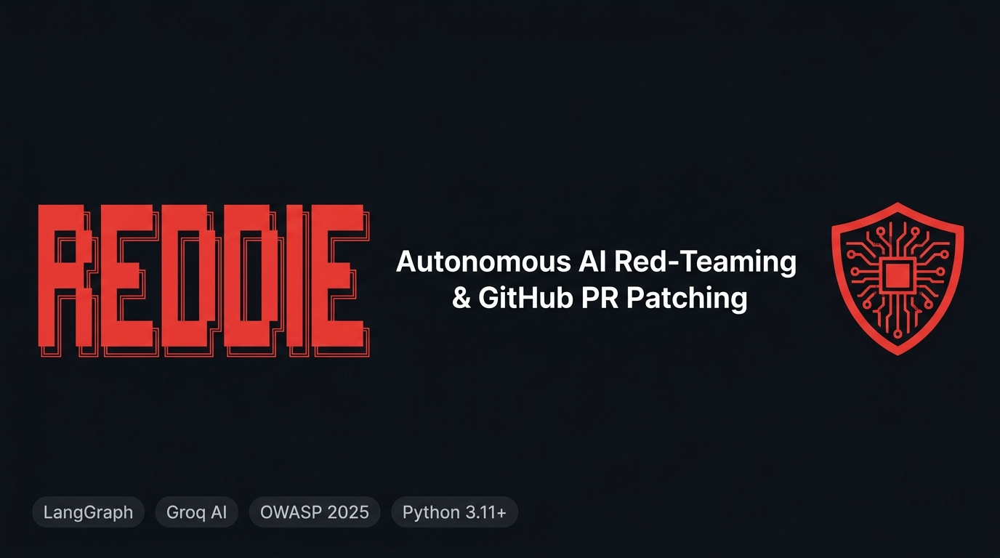

<p align="center">
  
</p>

<p align="center">
  <a href="https://pypi.org/project/reddie-ai/"></a>
  <a href="LICENSE"></a>
  <a href="action.yml"></a>
  
  
  <a href="NON_CS_EXPLAINER.md"></a>
</p>

---

**Reddie** is an autonomous DevSecOps tool that automatically discovers LLM application vulnerabilities, converts them into isolated `pytest` reproduction test suites, synthesizes hardened prompt/guardrail patches, verifies them in a test sandbox, and opens a GitHub Pull Request with the fix — all in a single command.

> 📖 **Not in Computer Science?** Read our [Plain-English Non-Technical Explainer](NON_CS_EXPLAINER.md) for a simple, analogy-based breakdown.

---

## ⚡ 1-Minute Quickstart

### Install & Run

```bash
# Install (local)
pip install -e .

# Mode 1: Offline — Fast deterministic heuristics, zero API cost
reddie --repo-path ./path/to/repo --export-html report.html --dry-run

# Mode 2: AI-Powered — Real LLM red-teaming via Groq
export GROQ_API_KEY="gsk_..."
reddie --repo-path ./path/to/repo --export-html report.html --dry-run

# Mode 3: Full pipeline — AI audit + live GitHub Pull Request
export GROQ_API_KEY="gsk_..."
export GITHUB_TOKEN="ghp_..."
reddie --repo-path ./path/to/repo --github-repo owner/repo --export-html report.html
```

### Turnkey GitHub Action

Add to `.github/workflows/reddie-security.yml`:

```yaml
name: 🛡️ Reddie Security Audit

on:
  pull_request:
    branches: [ main ]
  schedule:
    - cron: '0 2 * * *'  # Daily 2:00 AM UTC

jobs:
  security-audit:
    runs-on: ubuntu-latest
    permissions:
      contents: write
      pull-requests: write
    steps:
      - uses: actions/checkout@v4
      - name: Run Reddie
        uses: reddie-ai/reddie@v1
        with:
          repo-path: '.'
          github-token: ${{ secrets.GITHUB_TOKEN }}
          groq-key: ${{ secrets.GROQ_API_KEY }}
          export-html: 'report.html'
```

---

## 🏗️ How It Works

```
[RECON] ---> [REDTEAM] ---> [REPRODUCE] ---> [PATCH] ---> [VERIFY] ---> [PR]
```

| Stage | What it does |
| :--- | :--- |
| **Recon** | Static AST + regex analysis. Extracts system prompts and tool definitions from Python, JS, TS files. |
| **Red Team** | Generates and executes adversarial attacks using real LLM simulation (Groq) or deterministic heuristics. |
| **Reproduce** | Auto-generates an isolated `pytest` suite that proves the vulnerability is real and repeatable. |
| **Patch** | LLM-synthesized fix: injects confidentiality boundaries, input guardrails, and privilege checks into the source. |
| **Verify** | Runs both reproduction tests and full regression suite in a sandboxed subprocess. Retries up to 3 times. |
| **PR** | Pushes a `security/fix-*` branch and opens a GitHub Pull Request with the full audit report in the description. |

---

## 📊 OWASP Top 10 for LLM Applications (2025) Coverage

| OWASP ID | Category | Auto-Remediation |
| :--- | :--- | :--- |
| **LLM01** | Prompt Injection | Instruction locks & input guardrails |
| **LLM02** | Sensitive Information Disclosure | Confidentiality directives & token redaction |
| **LLM06** | Excessive Agency | Privilege boundary enforcement |
| **LLM07** | System Prompt Leakage | System instruction confidentiality boundaries |

---

## 🛠️ CLI Reference

```text
reddie [OPTIONS]

  --repo-path PATH        Target repository to scan (default: .)
  --endpoint-url URL      Live LLM API endpoint to fuzz (default: mock://local)
  --github-repo REPO      GitHub repo for PR creation (e.g. owner/repo)
  --github-token TOKEN    GitHub PAT (or GITHUB_TOKEN env var)
  --groq-key KEY          Groq API key (or GROQ_API_KEY env var)
  --provider PROVIDER     LLM provider: groq | openrouter | openai (default: groq)
  --export-html PATH      Save executive HTML audit report
  --export-json PATH      Save structured JSON audit report
  --max-retries N         Max auto-patch retry attempts (default: 3)
  --dry-run               Audit locally, skip GitHub PR creation
  -v, --verbose           Enable debug logging
```

---

## 🧪 Tests

```bash
pytest -v
# 13 passed in 3.5s
```

---

## 📁 Project Structure

```
reddie/
├── main.py                  # CLI entry point
├── workflow.py              # LangGraph StateGraph orchestration
├── state.py                 # AgentSecurityState TypedDict
├── agents/
│   ├── recon.py             # Static analysis node
│   ├── red_team.py          # Adversarial fuzzing node
│   ├── reproduce.py         # PyTest generator node
│   ├── patcher.py           # LLM patch synthesis node
│   ├── verifier.py          # Sandbox test runner node
│   └── github_pr.py         # Git branch + PR creator node
├── tools/
│   ├── static_analyzer.py   # AST + regex prompt/tool extractor
│   ├── fuzzer_client.py     # HTTP fuzzer + heuristic evaluator
│   ├── llm_client.py        # Groq client: simulate, judge, patch
│   ├── reporter.py          # HTML + JSON OWASP report generator
│   ├── git_tools.py         # Git branch/commit/push + PyGithub PR
│   └── test_runner.py       # Subprocess pytest harness
├── tests/                   # Full test suite (13 tests)
├── assets/
│   └── banner.jpg
├── Dockerfile
├── docker-compose.yml
├── action.yml               # GitHub Action definition
└── NON_CS_EXPLAINER.md      # Plain-English guide
```

---

<p align="center">
  Built with <a href="https://github.com/langchain-ai/langgraph">LangGraph</a> · Powered by <a href="https://groq.com">Groq</a> · Mapped to <a href="https://owasp.org/www-project-top-10-for-large-language-model-applications/">OWASP LLM Top 10 (2025)</a>
</p>
