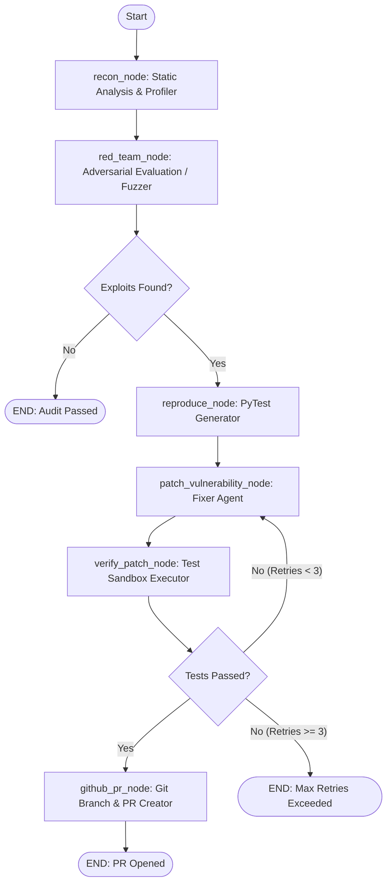

# 🛡️ Reddie: Autonomous AI Red-Teaming & GitHub PR Patching

[](https://pypi.org/project/reddie-ai/)
[](LICENSE)
[](action.yml)
[](tests/)
[](NON_CS_EXPLAINER.md)

**Reddie** is an autonomous DevSecOps tool that automatically discovers LLM application vulnerabilities, converts them into isolated `pytest` reproduction test suites, synthesizes hardened prompt/guardrail patches, verifies them in a test sandbox, and opens a GitHub Pull Request with the fix.

> 📖 **Not in Computer Science?** Read our [Plain-English Non-Technical Explainer (NON_CS_EXPLAINER.md)](NON_CS_EXPLAINER.md) for a simple, analogy-based breakdown of how Reddie works.

---

## ⚡ 1-Minute Quickstart

### Option A: Install via pip / CLI

```bash
# 1. Install Reddie
pip install reddie-ai
# or local editable install: pip install -e .
```

#### Run with Standard Environment Variables:
```bash
# Mode 1: Fast Deterministic Heuristics (Zero API cost, 100% offline)
reddie --repo-path ./path/to/repo --export-html report.html --export-json report.json --dry-run

# Mode 2: AI-Powered Red-Teaming via Groq (Export env var)
export GROQ_API_KEY="gsk_your_groq_key"
reddie --repo-path ./path/to/repo --export-html report.html --dry-run

# Mode 3: AI-Powered Red-Teaming via OpenAI (Export env var)
export OPENAI_API_KEY="sk-your_openai_key"
reddie --repo-path ./path/to/repo --provider openai --export-html report.html --dry-run

# Mode 4: Automated GitHub Pull Request Creation
export GITHUB_TOKEN="ghp_your_github_token"
export GROQ_API_KEY="gsk_your_groq_key"
reddie --repo-path ./path/to/repo --github-repo owner/repo-name --export-html report.html
```

---

### Option B: Turnkey GitHub Action
Add Reddie to any GitHub repository in `.github/workflows/reddie-security.yml`:

```yaml
name: 🛡️ Reddie Security Audit & Auto-Patch

on:
  pull_request:
    branches: [ main ]
  schedule:
    - cron: '0 2 * * *'  # Daily 2:00 AM UTC scan

jobs:
  security-audit:
    runs-on: ubuntu-latest
    permissions:
      contents: write
      pull-requests: write

    steps:
      - uses: actions/checkout@v4
      - name: Run Reddie AI Red-Teaming
        uses: reddie-ai/reddie@v1
        with:
          repo-path: '.'
          github-token: ${{ secrets.GITHUB_TOKEN }}
          export-html: 'report.html'
          export-json: 'report.json'
```

---

### Option C: Docker & Enterprise VPC Runner
```bash
docker build -t reddie-ai .
docker run --rm -v $(pwd):/workspace reddie-ai --repo-path /workspace --dry-run
```

---

## 🏗️ State Graph Workflow



---

## 📊 Official OWASP Top 10 for LLM Applications (2025) Coverage

Reddie maps all discovered vulnerabilities and auto-generated patches to the official **OWASP Top 10 for LLM Applications (2025)**:

| Category | Description | Auto-Remediation |
| :--- | :--- | :--- |
| **LLM01: Prompt Injection** | Adversarial inputs overriding execution logic or persona rules (including jailbreaks). | Prompt instruction locks & input guardrails |
| **LLM02: Sensitive Information Disclosure** | Leaking private credentials, customer PII, or internal training data. | Confidentiality directives & token redacting |
| **LLM06: Excessive Agency** | Over-privileged `@tool` functions or plugins executing unauthorized commands. | Privilege boundary enforcement |
| **LLM07: System Prompt Leakage** | Direct exfiltration or translation of confidential system prompts. | System instruction confidentiality boundaries |

---

## 🛠️ CLI Reference

```text
usage: reddie [-h] [--repo-path REPO_PATH] [--endpoint-url ENDPOINT_URL]
              [--github-repo GITHUB_REPO] [--github-token GITHUB_TOKEN]
              [--groq-key GROQ_KEY] [--provider {groq,openrouter,openai}]
              [--max-retries MAX_RETRIES] [--dry-run]
              [--export-html EXPORT_HTML] [--export-json EXPORT_JSON] [-v]

options:
  --repo-path REPO_PATH       Target repository path to scan (default: .)
  --endpoint-url ENDPOINT_URL Target LLM API endpoint (default: mock://local)
  --github-repo GITHUB_REPO   GitHub repository name (e.g. owner/repo)
  --github-token GITHUB_TOKEN GitHub Personal Access Token (or GITHUB_TOKEN env var)
  --groq-key GROQ_KEY         Groq API Key (or GROQ_API_KEY env var)
  --provider {groq,openrouter,openai}
                              LLM provider for AI reasoning (default: groq)
  --export-html EXPORT_HTML   Path to save clean executive HTML report
  --export-json EXPORT_JSON   Path to save structured JSON report
  --max-retries MAX_RETRIES   Maximum auto-patch retry attempts (default: 3)
  --dry-run                   Run audit locally without opening remote PRs
  -v, --verbose               Enable debug logging
```

---

## 🧪 Testing

```bash
pytest -v
# 13 passed in 3.35s
```
